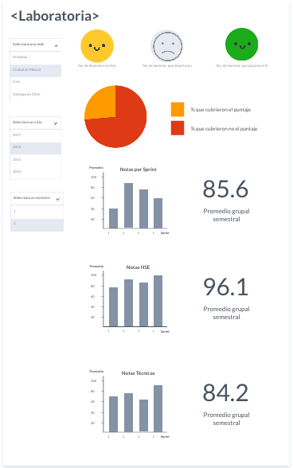

# 1. Análisis de *Laboratoria*
Qué partes conforman el UX y qué partes el UI:

# 2. Identificar los elementos de navegación de: *Github*

* **Global** situado en la barra superior.
* **Local** en los menus desplegables del usuario, situados en la barra de navegación del lado derecho.
* **Contextual** con la actividad del usuario, situado en la parte derecha del navegador.
* **Facetada** en las actualizaciones de los usuarios  a los que sigo, situado en la parte media del lado izquierdo.
* **Suplementaria** en el cuadro de recomendaciones de Github, situado en la parte superior derecha.

# 3. *Sketch* para la herramienta del dashboard de Laboratoria.

